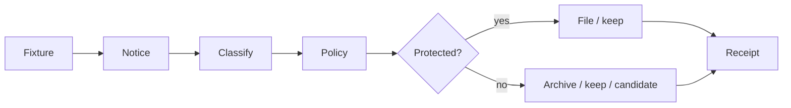

# klarpost

**Policy-as-code for inbox attention, not just messages.**

Email is interruption, obligation, and sensory load. klarpost gives a tired human readable YAML rules, a deterministic runner, and a paper trail that is hard to lose.

> Calm is not the same as empty.

Alpha 0.1.0 · Python 3.11+ · MIT · synthetic fixtures only

## The point of view

Spam filters optimize for less; klarpost optimizes for fewer irreversible mistakes. Every result has a named rule and plain-English reason. `delete_candidate` is only a human-reviewed suggestion. ADHD and high-sensory-load are honest constraints, not a universal claim.

## Policy is the nervous system

**Notice**, **name**, **choose**, **explain**, then **veto**.



## Receipts are sacred

- Orders, invoices, receipts, tickets, travel, banking, security, government, medical, legal, and identity mail are never delete candidates.
- `Your order - 20% off` is still an order.
- A candidate is never execution; a human decides.
- Ambiguity chooses `keep` or `ablegen`.

Hard protected categories are always unioned into packs; validation rejects weakened rails.

## Quick start

```bash
python -m venv .venv && source .venv/bin/activate
pip install -e ".[dev]"
klarpost validate -p policies/packs/inbox-calm.yaml
klarpost demo -p policies/packs/inbox-calm.yaml -f fixtures/inbox_mixed.json
```

## Good first issues

1. Attention-cost report: cost field + collision fixtures; no telemetry.
2. Quiet-hours pack: explicit schedule for low-urgency newsletters; receipts stay visible.
3. Policy lint: name the exact never-delete rail a risky rule collides with.

`pytest && ruff check src tests` · English-first docs · no live connectors, private samples, or silent deletion.

[MIT](LICENSE) · [AGENTS.md](AGENTS.md)
