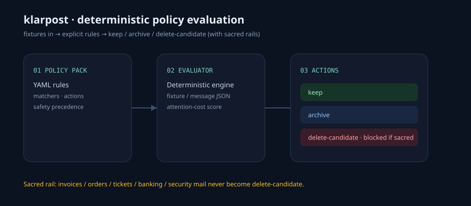
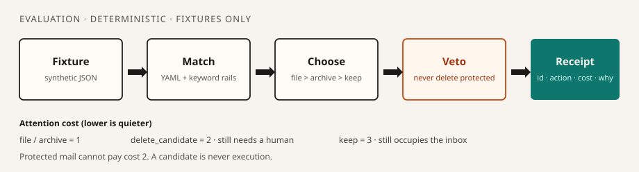

# klarpost


**Deterministic policy-as-code for inbox attention.**
YAML in. Named actions out. Protected mail cannot become a delete suggestion.

*klarpost* is German for “clear mail”.

[](https://github.com/clearmind93/klarpost/actions/workflows/ci.yml)
[](LICENSE)

Alpha **0.1.0** · Python **3.11+** · **fixtures only** — this CLI does not open a mailbox.

## Point of view

Spam filters guess. klarpost makes attention and deletion policy explicit and testable.

A newsletter and an invoice are both messages; losing the invoice costs more than reading one extra newsletter. Attention is a budget. Deletion is asymmetric. `delete_candidate` is a suggestion a human still has to accept.

ADHD and high-sensory-load are honest constraints for the design, not a universal-accessibility claim.

## Architecture





A pack is YAML a tired person can diff. The engine is the part they cannot turn off: **notice → name → choose → explain → veto**.


`ablegen` is the file action (German for putting documents away). It is a schema token, not UI copy. Priority is `ablegen` > `archive` > `keep` > `delete_candidate`.

| Concern | Typical ML filter | klarpost |
| --- | --- | --- |
| Decision | Score | YAML rule + rails |
| Deletion | May follow the score | Never executed |
| Audit | Opaque | Diffable receipt |

## Never-delete contract

Receipts are evidence, not clutter. **Preserve the paper trail before optimizing for quiet.** Prefer a visible false negative to an irreversible mistake.

Orders, invoices, receipts, tickets, travel, banking, security, government, medical, legal, and identity mail are **never** `delete_candidate`. Enforced in four places:

| Layer | What it does |
| --- | --- |
| Schema | Packs cannot classify a protected category as `delete_candidate`, default to it, or disable human review. Delete rules cannot *name* protected signals in their matchers. |
| Keyword rails | Conservative EN/DE phrases still fire if a pack is sloppy. |
| Runtime veto | If a delete rule and a protected signal both match, the engine files the message and records a safety veto. |
| CI | `klarpost evaluate --fail-on-delete` on `fixtures/protected_must_keep.json` for every sample pack. |

`Your order #12 — 50% off` is still an order. Ambiguity chooses `keep` or `ablegen`. A candidate is never execution.

## Attention cost

Not telemetry. A stable integer derived only from the final action, so tests can freeze inbox load the same way they freeze delete counts.

| Action | Cost | Why |
| --- | --- | --- |
| `ablegen` / `archive` | 1 | Decided. Out of the way. |
| `delete_candidate` | 2 | Still needs a human. |
| `keep` | 3 | Still occupies the inbox. |

Protected fixtures on `inbox-calm` are filed at cost **1**. The mixed demo inbox is frozen at **15/30**. See `tests/test_attention.py`.

## Quick start

```bash
python -m venv .venv && source .venv/bin/activate
python -m pip install -e ".[dev]"
klarpost validate -p policies/packs/inbox-calm.yaml
klarpost evaluate -p policies/packs/inbox-calm.yaml -f fixtures/inbox_mixed.json
klarpost explain -p policies/packs/inbox-calm.yaml -f fixtures/inbox_mixed.json -m fx-order-promo-collision
klarpost demo -p policies/packs/inbox-calm.yaml -f fixtures/inbox_mixed.json
```

`explain` prints a receipt: action, attention cost, veto, and the why-list. Nothing touches a mailbox. Live-mail flags (`--imap`, `--password`, `--oauth`, …) exit 2.

```bash
klarpost evaluate -p policies/packs/inbox-calm.yaml \
  -f fixtures/protected_must_keep.json --fail-on-delete
```

## Codex / maintainer workflow

Read [`AGENTS.md`](AGENTS.md). Policy changes ship with a positive fixture, a near miss, and a protected collision where relevant. Keep reasons English-first. Review precedence, action, reason, rail, and attention cost — not only green CI.

```bash
pytest
ruff check src tests
klarpost validate -p policies/packs/<pack>.yaml
```

## Repo map

| Path | Role |
| --- | --- |
| `src/klarpost/` | Evaluator, safety rails, attention cost, fixtures-only CLI |
| `policies/packs/` | Sample packs (`protected-only`, `receipts-first`, `inbox-calm`) |
| `fixtures/` | Synthetic mail (`example.com` only) |
| [AGENTS.md](AGENTS.md) | Maintainer contract for humans and coding agents |
| [DESIGN.md](DESIGN.md) | Why the boundary looks like this |
| [SECURITY.md](SECURITY.md) | Policy-bypass is a vulnerability class |

## Status

Public alpha. The interesting work is the evaluator and the rails, not a connector. Live IMAP/SMTP/OAuth is out of scope on purpose. Issues that ask for a mailbox should be parked, not prototyped.

[Contributing](CONTRIBUTING.md) · [Changelog](CHANGELOG.md) · [MIT](LICENSE)
